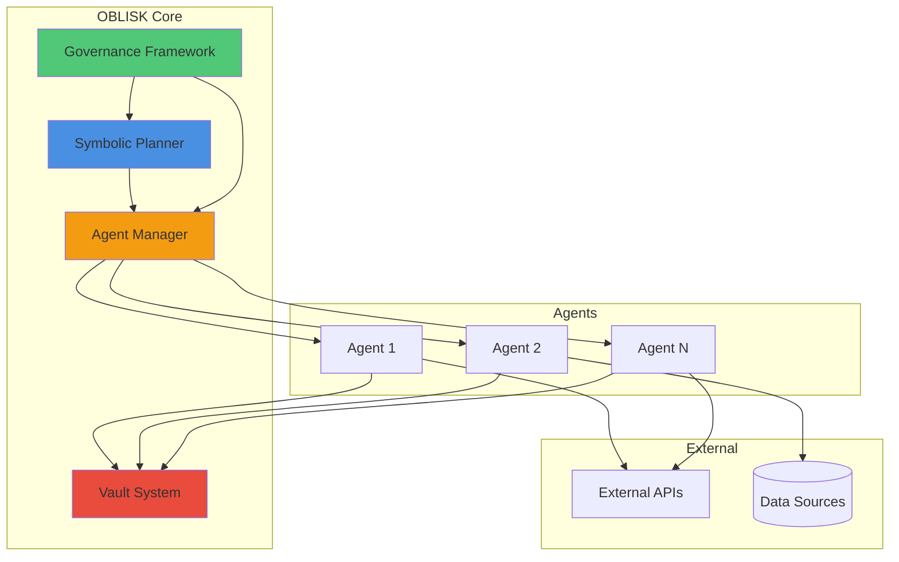

# OBLISK

> **A secure, symbolic multi-agent AI orchestration framework with encrypted vaults and governed decision-making.**

[](https://github.com/POWDER-RANGER/OBLISK/actions/workflows/ci.yml) [](https://github.com/POWDER-RANGER/OBLISK/blob/main/LICENSE) [](https://securityscorecards.dev/viewer/?uri=github.com/POWDER-RANGER/OBLISK) [](https://github.com/POWDER-RANGER/OBLISK/blob/main/CONTRIBUTING.md)

---

## ✨ Features

- **🔐 Encrypted Vaults**: Secure storage with AES-256 encryption for sensitive agent data and credentials
- **🤖 Multi-Agent Coordination**: Dynamic agent lifecycle management with role-based task distribution
- **🧠 Symbolic Planning**: Logic-based reasoning engine for complex decision-making and goal decomposition
- **📊 Governance Framework**: Policy enforcement, audit logging, and ethical constraint validation
- **🔄 Event-Driven Architecture**: Real-time inter-agent messaging with pub/sub patterns
- **📈 Observable & Traceable**: Comprehensive logging and monitoring for all agent activities

---

## 🚀 Quick Start

### Prerequisites

- Python 3.8+ (tested on 3.8, 3.9, 3.10, 3.11)
- pip or poetry for dependency management
- Git

### Installation

#### Linux / macOS

```bash
git clone https://github.com/POWDER-RANGER/OBLISK.git
cd OBLISK
python3 -m venv venv
source venv/bin/activate
pip install -r requirements.txt
python -m oblisk.main
```

#### Windows (PowerShell)

```powershell
git clone https://github.com/POWDER-RANGER/OBLISK.git
cd OBLISK
python -m venv venv
.\venv\Scripts\Activate.ps1
pip install -r requirements.txt
python -m oblisk.main
```

#### Windows (CMD)

```cmd
git clone https://github.com/POWDER-RANGER/OBLISK.git
cd OBLISK
python -m venv venv
venv\Scripts\activate.bat
pip install -r requirements.txt
python -m oblisk.main
```

---

## 🏗️ Architecture



### Core Components

1. **Symbolic Planner** (`core/symbolic_planner.py`): Breaks down high-level goals into actionable tasks using logic programming
2. **Agent Manager** (`agents/agent_manager.py`): Spawns, monitors, and coordinates agent lifecycles
3. **Vault System** (`vault/vault.py`): Encrypted key-value store for secrets and sensitive data
4. **Governance Framework** (`core/governance.py`): Enforces policies and ethical constraints

---

## ⚙️ Configuration

Create a `config.yaml` in the project root:

```yaml
oblisk:
  vault:
    encryption_key_path: "/path/to/keyfile"
    storage_path: "./vault_data"
  agents:
    max_concurrent: 10
    timeout_seconds: 300
  planner:
    reasoning_engine: "prolog"  # or "datalog"
    max_depth: 5
  governance:
    policy_path: "./policies/default.json"
    audit_log_path: "./logs/audit.log"
    enforce_ethics: true

logging:
  level: "INFO"
  format: "json"
```

Alternatively, use JSON format (`config.json`):

```json
{
  "oblisk": {
    "vault": {
      "encryption_key_path": "/path/to/keyfile",
      "storage_path": "./vault_data"
    },
    "agents": {
      "max_concurrent": 10,
      "timeout_seconds": 300
    },
    "planner": {
      "reasoning_engine": "prolog",
      "max_depth": 5
    },
    "governance": {
      "policy_path": "./policies/default.json",
      "audit_log_path": "./logs/audit.log",
      "enforce_ethics": true
    }
  },
  "logging": {
    "level": "INFO",
    "format": "json"
  }
}
```

---

## 🔍 How It Works

### 1. Vault System

The Vault provides secure, encrypted storage for agent credentials and sensitive data:

- **Encryption**: AES-256-GCM with per-entry nonces
- **Key Management**: Supports file-based keys, environment variables, or HSM integration
- **Access Control**: Role-based permissions with audit logging
- **API**: Simple `set(key, value)` and `get(key)` interface

```python
from oblisk.vault import Vault

vault = Vault(key_path="/path/to/key")
vault.set("api_token", "sensitive-token-123")
token = vault.get("api_token")
```

### 2. Agent Communication

Agents communicate via a pub/sub messaging system:

- **Topics**: Agents subscribe to relevant topics (e.g., `tasks.analysis`, `events.alerts`)
- **Message Bus**: Centralized event bus with guaranteed delivery
- **Serialization**: JSON or Protocol Buffers for efficient data transfer
- **Security**: All messages are signed and optionally encrypted

```python
from oblisk.agents import Agent

class DataAgent(Agent):
    def on_message(self, topic, payload):
        if topic == "tasks.fetch_data":
            data = self.fetch_from_api(payload["source"])
            self.publish("data.fetched", {"result": data})
```

### 3. Symbolic Planner

The Planner decomposes goals into executable plans:

- **Input**: High-level goal (e.g., "Analyze sentiment from social media")
- **Processing**:
  - i. Goal decomposition into sub-goals
  - ii. Agent capability matching
  - iii. Dependency resolution and ordering
  - iv. Resource allocation
- **Output**: Directed acyclic graph (DAG) of tasks assigned to agents
- **Execution**: Tasks run in parallel where possible, with failure recovery

```python
from oblisk.core import SymbolicPlanner

planner = SymbolicPlanner()
plan = planner.create_plan(
    goal="Analyze sentiment from Twitter",
    constraints=["cost < 100", "time < 5min"]
)
planner.execute(plan)
```

---

## 📚 Documentation

- [Full Documentation](./docs/README.md)
- [Security Best Practices](./SECURITY.md)
- [Contributing Guide](./CONTRIBUTING.md)

---

## 🧪 Examples

See the [`examples/`](./examples) directory for sample implementations:

- `simple_agent.py`: Basic agent setup

---

## 🤝 Contributing

We welcome contributions! Please see [CONTRIBUTING.md](./CONTRIBUTING.md) for guidelines.

1. Fork the repository
2. Create a feature branch (`git checkout -b feature/amazing-feature`)
3. Commit your changes (`git commit -m 'feat: add amazing feature'`)
4. Push to the branch (`git push origin feature/amazing-feature`)
5. Open a Pull Request

---

## 📜 License

This project is licensed under the MIT License - see the [LICENSE](./LICENSE) file for details.

---

## 🛡️ Security

Please report security vulnerabilities via our [Security Policy](./SECURITY.md). Do not open public issues for security concerns.

---

## 📞 Support

- **Issues**: [GitHub Issues](https://github.com/POWDER-RANGER/OBLISK/issues)
- **Discussions**: [GitHub Discussions](https://github.com/POWDER-RANGER/OBLISK/discussions)
- **Wiki**: [Project Wiki](https://github.com/POWDER-RANGER/OBLISK/wiki)

---

**Built with ❤️ by the POWDER-RANGER team**
