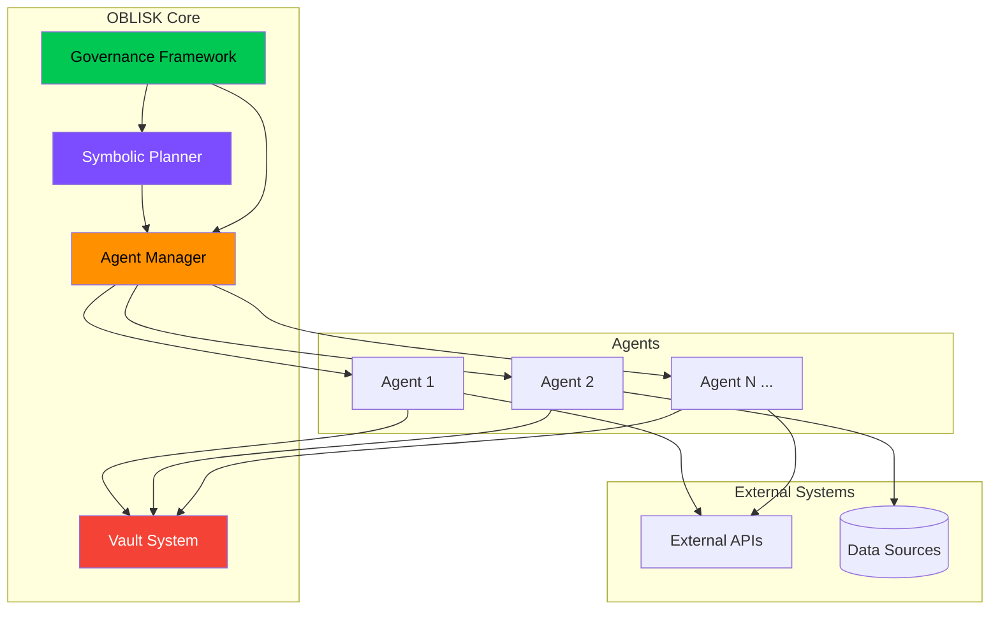

<!-- ══════════════════════════════════════════ OBLISK HEADER -->
<div align="center">

[](https://github.com/POWDER-RANGER/OBLISK)

<br>

[](https://github.com/POWDER-RANGER/OBLISK)

<br>


</div>

---

## ✨ Features

| Feature | Description |
|---------|-------------|
| 🔐 **Encrypted Vaults** | AES-256-GCM encryption with per-entry nonces for sensitive agent data |
| 🤖 **Multi-Agent Coordination** | Dynamic agent lifecycle with role-based task distribution |
| 🧠 **Symbolic Planning** | Logic-based reasoning engine for goal decomposition and task planning |
| 📊 **Governance Framework** | Policy enforcement, audit logging, and ethical constraint validation |
| 🔄 **Event-Driven Architecture** | Real-time inter-agent messaging with pub/sub patterns |
| 📈 **Observable & Traceable** | Comprehensive logging and monitoring for all agent activities |

---

## 🏗️ Architecture


```mermaid
graph TB
    subgraph "OBLISK Core"
        SP[Symbolic Planner]
        AM[Agent Manager]
        V[Vault System]
        GF[Governance Framework]
    end
    
    subgraph "Agents"
        A1[Agent 1]
        A2[Agent 2]
        A3[Agent N ...]
    end
    
    subgraph "External Systems"
        API[External APIs]
        DB[(Data Sources)]
    end
    
    SP --> AM
    AM --> A1
    AM --> A2
    AM --> A3
    
    A1 --> V
    A2 --> V
    A3 --> V
    
    GF --> SP
    GF --> AM
    
    A1 --> API
    A2 --> DB
    A3 --> API
    
    style SP fill:#7C4DFF,color:#fff
    style V fill:#F44336,color:#fff
    style GF fill:#00C853,color:#000
    style AM fill:#FF9100,color:#000
```

---

## 🚀 Quick Start

```bash
# Clone
git clone https://github.com/POWDER-RANGER/OBLISK.git
cd OBLISK
python3 -m venv venv
source venv/bin/activate  # Windows: .\\venv\\Scripts\\Activate.ps1
pip install -r requirements.txt
python -m oblisk.main
```

### Configuration (`config.yaml`)

```yaml
oblisk:
  vault:
    encryption_key_path: "/path/to/keyfile"
    storage_path: "./vault_data"
  agents:
    max_concurrent: 10
    timeout_seconds: 300
  planner:
    reasoning_engine: "prolog"
    max_depth: 5
  governance:
    policy_path: "./policies/default.json"
    audit_log_path: "./logs/audit.log"
    enforce_ethics: true
```

---

## 🔍 How It Works

### 1. Vault System — Secure Storage

```python
from oblisk.vault import Vault

vault = Vault(key_path="/path/to/key")
vault.set("api_token", "sensitive-token-123")
token = vault.get("api_token")  # Decrypted on-the-fly
```

### 2. Agent Communication — Pub/Sub Messaging

```python
from oblisk.agents import Agent

class DataAgent(Agent):
    def on_message(self, topic, payload):
        if topic == "tasks.fetch_data":
            data = self.fetch_from_api(payload["source"])
            self.publish("data.fetched", {"result": data})
```

### 3. Symbolic Planner — Goal Decomposition

```python
from oblisk.core import SymbolicPlanner

planner = SymbolicPlanner()
plan = planner.create_plan(
    goal="Analyze sentiment from Twitter",
    constraints=["cost < 100", "time < 5min"]
)
planner.execute(plan)  # Returns DAG of tasks assigned to agents
```

---

## 📦 Core Components

| Module | File | Responsibility |
|--------|------|----------------|
| Symbolic Planner | `core/symbolic_planner.py` | Goal decomposition into actionable tasks |
| Agent Manager | `agents/agent_manager.py` | Agent lifecycle management and coordination |
| Vault System | `vault/vault.py` | AES-256 encrypted key-value store |
| Governance Framework | `core/governance.py` | Policy enforcement and ethical validation |
| Message Bus | `messaging/bus.py` | Pub/sub with guaranteed delivery |

---

## 📈 GitHub Stats

<div align="center">


</div>

---

## 🔗 POWDER-RANGER Ecosystem

### 🌐 Live .io Pages
| Project | Link | Description |
|---------|------|-------------|
| **Main Portfolio** | [powder-ranger.github.io](https://powder-ranger.github.io) | Master portfolio with all 46 repos |
| **OBLISK** | [powder-ranger.github.io/OBLISK](https://powder-ranger.github.io/OBLISK) | Multi-agent AI orchestration demo |
| **CIVWATCH** | [powder-ranger.github.io/CIVWATCH](https://powder-ranger.github.io/CIVWATCH) | Civic transparency platform |
| **AI Nexus** | [powder-ranger.github.io/ai-nexus](https://powder-ranger.github.io/ai-nexus) | Browser-based AI platform |
| **Dollar Gravity** | [powder-ranger.github.io/dollar-gravity-framework](https://powder-ranger.github.io/dollar-gravity-framework) | USD gravity visualization |

### 🔧 Core Repositories
| Repository | Language | Purpose |
|-----------|----------|---------|
| **[OBLISK](https://github.com/POWDER-RANGER/OBLISK)** | Python | Multi-agent AI with encrypted vaults (this repo) |
| **[CIVWATCH](https://github.com/POWDER-RANGER/CIVWATCH)** | TypeScript | Civic transparency platform |
| **[RED-AGENT-GOV](https://github.com/POWDER-RANGER/RED-AGENT-GOV)** | Python | Governance-enforced agent engine |
| **[CharlesAI](https://github.com/POWDER-RANGER/CharlesAI)** | PowerShell | COMET Agent with memory & orchestration |
| **[OBELISK-Enterprise](https://github.com/POWDER-RANGER/OBELISK-Enterprise)** | Python | $2.5M AI Governance Platform |
| **[NSO Kryptonite](https://github.com/POWDER-RANGER/nso-kryptonite-platform)** | TypeScript | Adversarial defense command center |
| **[AI Nexus](https://github.com/POWDER-RANGER/ai-nexus)** | JavaScript | Browser-based complete AI platform |
| **[Guiding Light AI](https://github.com/POWDER-RANGER/guiding-light-ai)** | Rust | Values-to-policies CLI tool |
| **[Dollar Gravity](https://github.com/POWDER-RANGER/dollar-gravity-framework)** | JavaScript | USD-centric finance-security dashboard |
| **[Dojin D](https://github.com/POWDER-RANGER/dojin-d)** | TypeScript | ECS combat simulation engine |
| **[Contextual Memory UI](https://github.com/POWDER-RANGER/contextual-memory-ui)** | JavaScript | AI memory infrastructure platform |
| **[OBELISK-Desktop-AI](https://github.com/POWDER-RANGER/OBELISK-Desktop-AI)** | PowerShell | Desktop AI orchestrator |
| **[POWDER-RANGER Bot](https://github.com/POWDER-RANGER/powder-ranger-bot)** | Python | Autonomous GTA V + MGS5 agent |
| **[CIVWATCH Cell Titan](https://github.com/POWDER-RANGER/civwatch-cell-titan)** | Shell | RF observability platform |
| **[CIVWATCH v3](https://github.com/POWDER-RANGER/civwatch-v3)** | HTML | Unified RF observability |

---

## 🤝 Connect

[](https://www.linkedin.com/in/curtis-farrar-g6b)
[](https://github.com/POWDER-RANGER)
[](https://powder-ranger.github.io)
[](https://orcid.org/0009-0008-9273-2458)

---

## 🛡️ Security

Please report security vulnerabilities via our [Security Policy](./SECURITY.md). Do not open public issues for security concerns.

---

**Built with ❤️ and 🔮 symbolic reasoning by the POWDER-RANGER team**

<div align="center">

[](https://github.com/POWDER-RANGER/OBLISK)

</div>
